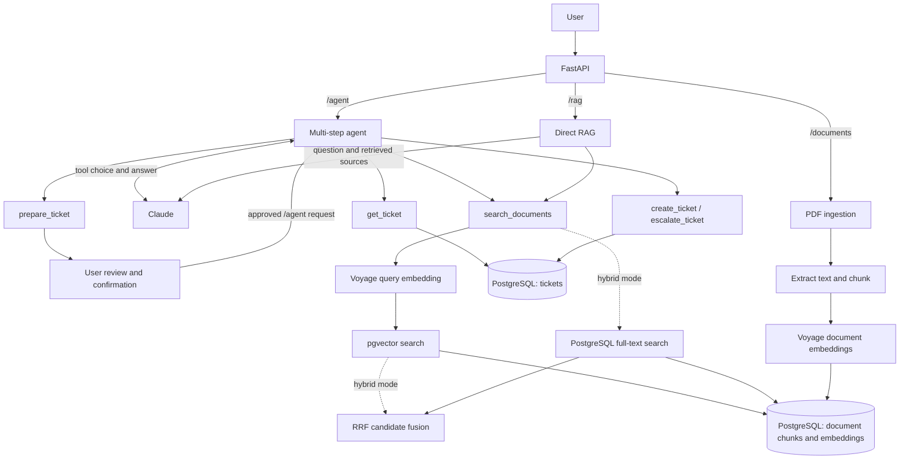

# AI IT Support Agent

An AI support system that combines RAG and agentic tool calling to answer IT-policy questions and manage support tickets.

```text
                  User
                   ↓
                FastAPI
                   ↓
             Agent ↔ Claude
           ┌───────┴────────┐
           ↓                ↓
     Knowledge RAG       Ticket Tools
           ↓                ↓
   Voyage + pgvector    PostgreSQL
```

## Key Features

- Answers IT-policy questions from PDF documents using RAG with source citations.
- Includes a browser chat with bounded conversation context, clickable citations, request activity and agent-prepared ticket proposals confirmed in the conversation.
- Supports vector search and optional hybrid retrieval combining pgvector with PostgreSQL full-text search.
- Uses a bounded multi-step agent loop to search documents and read, create, or escalate support tickets.
- Keeps agent write tools disabled by default; enabling ticket creation through the agent requires an explicit allowed action and an idempotency key.
- Validates tool calls and enforces critical business rules server-side rather than relying on the LLM.
- Logs request, retrieval, LLM, token, and tool timing as structured JSON for observability.
- Includes retrieval, chunking, agent, and prompt-injection evaluation.

## Architecture

FastAPI exposes `/agent`, `/rag`, `/search`, and ticket endpoints. Voyage embeds questions and document chunks; pgvector ranks matching chunks in PostgreSQL. Hybrid mode combines vector and full-text candidates using Reciprocal Rank Fusion (RRF). Claude decides when to use the allowed tools and writes the final answer. The server validates tool calls, while PostgreSQL enforces critical rules such as ticket escalation.



For agent requests, Pydantic validates tool inputs, `allowed_actions` gates writes, idempotency prevents duplicate ticket creation, and citation checks reject unknown source references. Structured logs trace requests and tool calls; [evaluation](evaluation/REPORT.md) measures retrieval, agent behavior, and prompt-injection resistance offline.

## Example

With Compose running, try these three requests in a Bash-compatible shell. Upload and embed a policy PDF before the second request.

```bash
# Health check
curl -sS http://127.0.0.1:8001/health

# Agent answer with a source citation
curl -sS http://127.0.0.1:8001/agent \
  -H 'Content-Type: application/json' \
  -d '{"message":"What is the minimum password length?"}'

# Prepare a ticket proposal for review; no ticket is created by this request
curl -sS http://127.0.0.1:8001/agent \
  -H 'Content-Type: application/json' \
  -d '{"message":"Prepare a ticket: my laptop will not start."}'
```

The agent response includes tool results in `steps` and measured request activity in `trace`. Review and confirm a ticket proposal in the chat to create it. Interactive API examples are available in Swagger UI at `/docs`.

## Tech Stack

Python, FastAPI, Pydantic, PostgreSQL + pgvector, Voyage AI embeddings, Anthropic Claude, and Docker Compose.

## Evaluation

The expanded retrieval benchmark contains 41 questions over five synthetic policy PDFs and 13 troubleshooting runbooks. It measures Recall@1/3/5/20 and full evidence coverage per question, using the same corpus and embeddings for vector, lexical and hybrid retrieval.

Vector search found all required evidence in Top-5 for **41/41 questions**, compared with **40/41 for hybrid**. Hybrid improved identifier questions at Top-1 from **11/13 to 13/13**, but hurt an unsolicited MFA-prompt question. Vector remains the default; hybrid is available for explicit selection and further experiments.

Earlier checks compared three chunkers and tested agent behavior and a retrieved prompt injection. Reranking is deferred. These are small, synthetic evaluations; see the [evaluation report](evaluation/REPORT.md) for measured trade-offs, limitations and reproduction steps.

## Run Locally

Copy `.env.example` to `.env`, set `VOYAGE_API_KEY` and `ANTHROPIC_API_KEY`, then run. `.env` is excluded by `.gitignore`; keep API keys there.

```powershell
docker compose up -d --build --wait app
```

Open the [chat](http://127.0.0.1:8001/) or [Swagger UI](http://127.0.0.1:8001/docs). Upload a PDF from [`evaluation/fixtures/pdfs`](evaluation/fixtures/pdfs) through Swagger, then run `docker compose exec app python -m app.embed_chunks` before asking document questions.

See the [technical guide](docs/TECHNICAL_GUIDE.md) for ticket confirmation, request activity, conversation limits, hybrid settings and test commands.

## Design Decisions

- Kept 1000-character chunks with 200-character overlap after comparing retrieval across three strategies.
- Kept vector search as the default after hybrid improved exact identifiers but reduced overall Top-5 evidence coverage.
- Deferred reranking while testing retrieval and fusion on a broader dataset.
- Treats retrieved text as data; tool names, arguments, write permissions, and citations are checked by the server.
