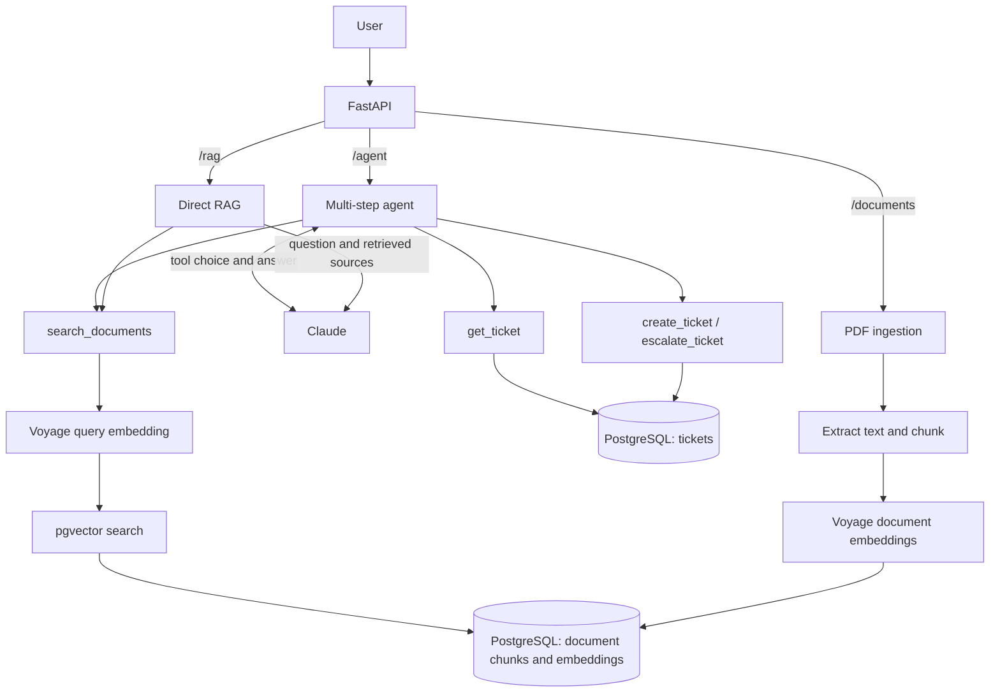

# AI IT Support Agent

An AI support system that combines RAG and agentic tool calling to answer IT-policy questions and manage support tickets.

**Portfolio release:** v1.0.0

```text
                  User
                   ↓
                FastAPI
                   ↓
             Agent ↔ Claude
           ┌───────┴────────┐
           ↓                ↓
     Knowledge RAG       Ticket Tools
           ↓                ↓
   Voyage + pgvector    PostgreSQL
```

## Key Features

- Answers IT-policy questions from PDF documents using RAG with source citations.
- Uses a bounded multi-step agent loop to search documents and read, create, or escalate support tickets.
- Keeps write tools disabled by default; ticket creation requires an explicit allowed action and an idempotency key.
- Validates tool calls and enforces critical business rules server-side rather than relying on the LLM.
- Logs request, retrieval, LLM, token, and tool timing as structured JSON for observability.
- Includes retrieval, chunking, agent, and prompt-injection evaluation.

## Architecture

FastAPI exposes `/agent`, `/rag`, `/search`, and ticket endpoints. Voyage embeds questions and document chunks; pgvector ranks matching chunks in PostgreSQL. Claude decides when to use the allowed tools and writes the final answer. The server validates tool calls, while PostgreSQL enforces critical rules such as ticket escalation.



For agent requests, Pydantic validates tool inputs, `allowed_actions` gates writes, idempotency prevents duplicate ticket creation, and citation checks reject unknown source references. Structured logs trace requests and tool calls; [evaluation](evaluation/REPORT.md) measures retrieval, agent behavior, and prompt-injection resistance offline.

## Example

With Compose running, try these three requests in a Bash-compatible shell. Upload and embed a policy PDF before the second request.

```bash
# Health check
curl -sS http://127.0.0.1:8001/health

# Agent answer with a source citation
curl -sS http://127.0.0.1:8001/agent \
  -H 'Content-Type: application/json' \
  -d '{"message":"What is the minimum password length?"}'

# Authorized ticket creation; reuse this UUID only when retrying this request
curl -sS http://127.0.0.1:8001/agent \
  -H 'Content-Type: application/json' \
  -d '{"message":"Open a high-priority ticket: my laptop will not start.","allowed_actions":["create_ticket"],"idempotency_key":"123e4567-e89b-42d3-a456-426614174000"}'
```

The agent response includes its tool results in `steps`. Interactive examples are available in Swagger UI at `/docs`.

## Tech Stack

Python, FastAPI, Pydantic, PostgreSQL + pgvector, Voyage AI embeddings, Anthropic Claude, and Docker Compose.

## Evaluation

On the 11-question synthetic policy dataset, all required evidence appeared within the Top-3 retrieval results. Retrieval is measured using Recall@1, Recall@3, Recall@5, and Recall@20.

A chunking experiment compared 500/100, 1000/200, and section-based strategies. All three achieved 11/11 at Top-3, while 1000/200 used the fewest chunks and achieved 8/11 at Top-1, so it was kept as the default.

Because the current dataset already achieves full Top-3 evidence coverage, reranking was not added yet. A prompt-injection test verifies that malicious instructions retrieved from a document are treated as data and do not trigger `create_ticket`. These are small, synthetic evaluations; see the [evaluation report](evaluation/REPORT.md).

## Run Locally

Copy `.env.example` to `.env`, set `VOYAGE_API_KEY` and `ANTHROPIC_API_KEY`, then run. `.env` is excluded by `.gitignore`; keep API keys there.

```powershell
docker compose up -d --build --wait app
```

Open [Swagger UI](http://127.0.0.1:8001/docs). Upload a PDF from [`evaluation/fixtures/pdfs`](evaluation/fixtures/pdfs), then run `docker compose exec app python -m app.embed_chunks` before asking document questions.

## Design Decisions

- Kept 1000-character chunks with 200-character overlap after comparing retrieval across three strategies.
- Chose not to add reranking because Top-3 retrieval already covered all required evidence in the current test set.
- Treats retrieved text as data; tool names, arguments, write permissions, and citations are checked by the server.
